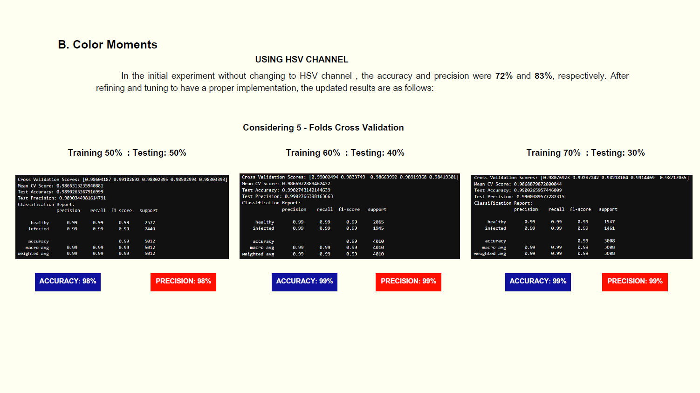

# Phytoplasma Disease of Cassava Leaf Recognition and Analysis using Color Features and Linear Support Vector Machine
 Developed as research project for CSci 142 - Graphics and Visual Computing, aims to advance the recognition and analysis of phytoplasma disease in cassava leaves through sophisticated image processing and machine learning techniques.

## S U M M A R Y  &nbsp; O V E R V I E W

 ## Datasets

## Proposed Methodlogy

## 1. Image Acquisition

## 2. Image Preprocessing

## 3. Image Segmentation

## 4. Feature Extraction Results
### A. Confusion Matrix

### B. Graph Visualization

## 5. Intelligent System Used
### LINEAR SUPPORT VECTOR MACHINE

### A. Global Color Historgram Results

### B. Color Moments Results

