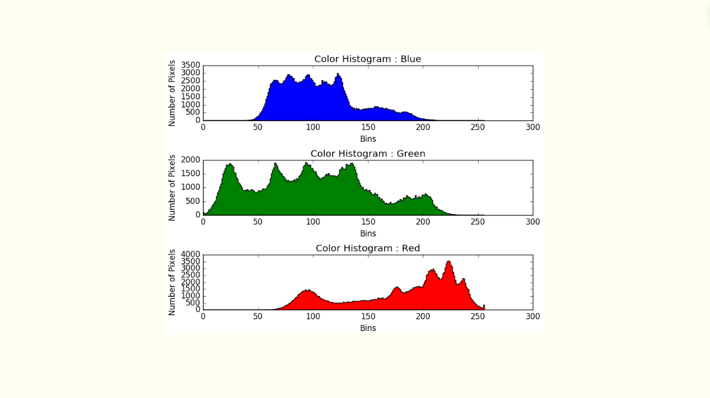
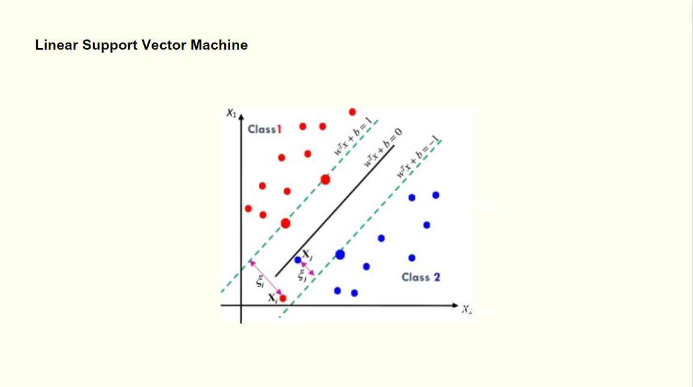
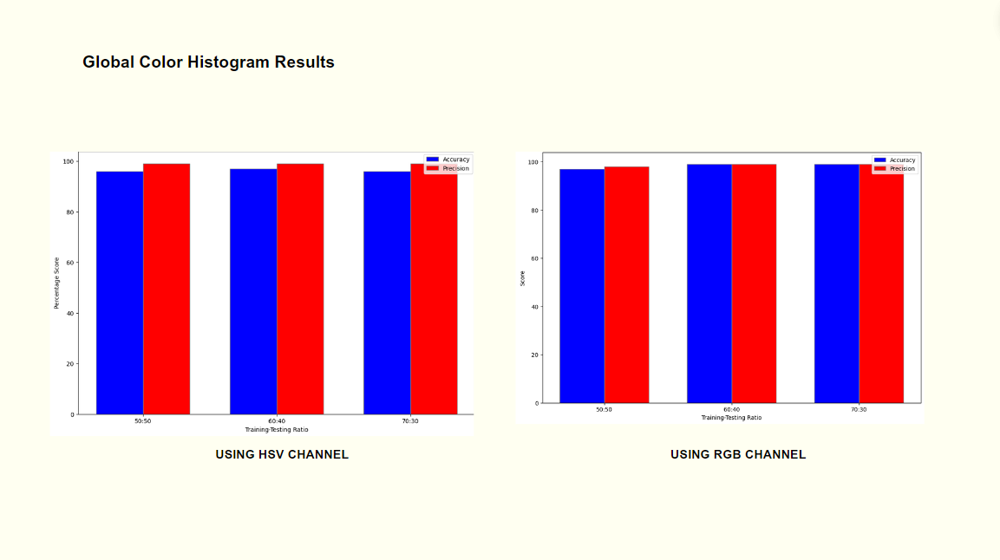
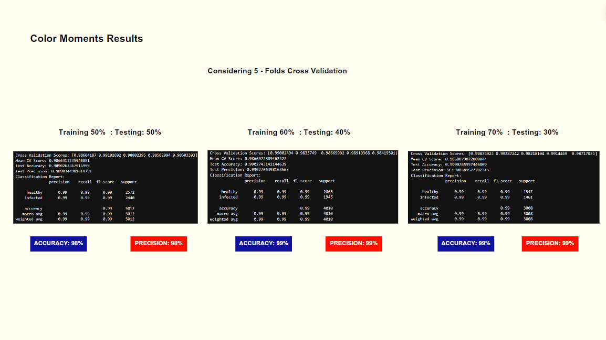

# Phytoplasma Disease of Cassava Leaf Recognition and Analysis using Color Features and Linear Support Vector Machine
 Developed as research project for CSci 142 - Graphics and Visual Computing, aims to advance the recognition and analysis of phytoplasma disease in cassava leaves through sophisticated image processing and machine learning techniques.

## S U M M A R Y  &nbsp; O V E R V I E W

 ## Processed Datasets

## Proposed Methodlogy

## Processed Datasets

## 1. Image Acquisition

## 2. Image Preprocessing

## 3. Image Segmentation

## Processed Datasets

## 4. Feature Extraction Used
### A. Modified Color Feature Extraction

### B. Global Color Histogram

### C. Color Moments

## 5. Image Splitting

## 6. Intelligent System Used
### LINEAR SUPPORT VECTOR MACHINE

### A. Linear SVM - Global Color Historgram Results

### B. Linear SVM - Color Moments Results

